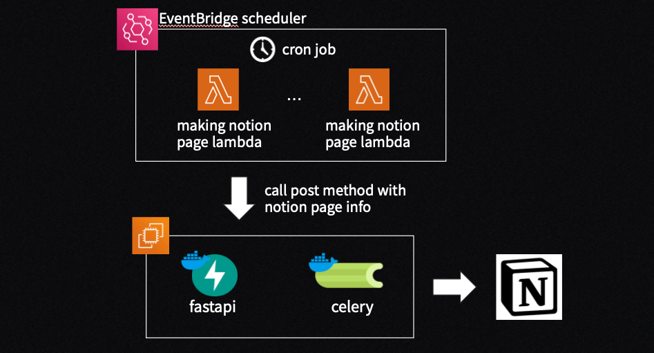
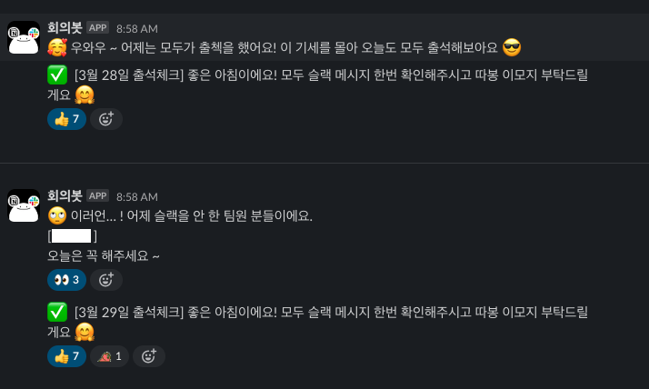

## 노션 회의 봇에 사용된 람다 코드 모음
### 스크럼 페이지 자동 생성 람다

- 스크럼 자동 생성 로직을 본 서버에서 Lambda와 EventBridge로 분리
- 회의 메타 정보 변경시 빠른 배포로 유연한 대처 가능
- https://velog.io/@leehjhjhj/효율적인-프로젝트를-위한-노션-슬랙-봇2-고도화-페이지-자동-생성
### 출석 체크 람다

- Event Bridge와 통합하여 설계
- 매일 9시에 특정 채널에 ":white_check_mark:"가 포함된 메시지를 전송
- 팀원들은 하루에 쌓인 슬랙 메시지를 모두 확인하고 해당 메시지에 이모지로 반응
- 매일 8시 58분에 ":white_check_mark:"가 달린 출석체크 메시지의 이모지를 단 팀원들을 스캔하고, 체크를 하지 않은 팀원들을 반환